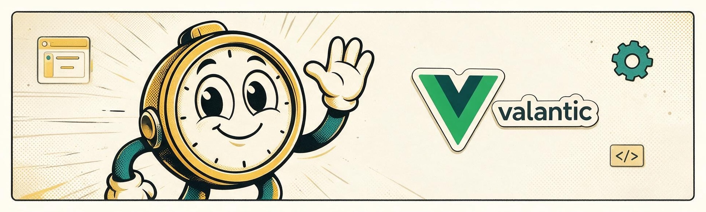

<div align="center">



# vue styleguide

**A pluggable Developer Experience (DX) utility for Vue 3 projects.**

[**View Docs**](https://valantic.github.io/vue-styleguide) ·
[**View Demo**](https://valantic.github.io/vue-styleguide/demo/) ·
[**Report an Issue**](https://github.com/valantic/vue-styleguide/issues/new) ·
[**Request a Feature**](https://github.com/valantic/vue-styleguide/issues/new?labels=enhancement)

</div>

---

## About this project

This library provides a standardized, interactive sidebar designed to be integrated into any Vue 3 project during development. It acts as a "testing harness," allowing developers to quickly navigate test/demo pages and manipulate global application states (like themes and languages) through a unified interface.

## Quickstart

This lib is also part of the [vue-template](https://github.com/valantic/vue-template) project. Check this page for a more complex usage.

To reduce dev overhead it is currently only installable by a github link. Add this to your package.json.

Find available versions here: [Github Releases](https://github.com/valantic/vue-styleguide/tags)

<<<<<<< HEAD
Roadmap:

- More config possibilities for a certain feature or page.
- Slots in `l-vas-layout` for common used things like documentation link or description.

## Documentation

Full documentation — installation, setup, demo pages, x-ray mode, release process — lives at
**[valantic.github.io/vue-styleguide](https://valantic.github.io/vue-styleguide)**.

## Demo

See this project in action: [Demo-Page](https://valantic.github.io/vue-styleguide/demo/)

## Quickstart

This lib is part of the [vue-template](https://github.com/valantic/vue-template) project. Check this page for a more complex usage.

To reduce dev overhead it is currently only installable by a github link. Add this to your package.json.

Find available versions here: [https://github.com/valantic/vue-styleguide/tags](https://github.com/valantic/vue-styleguide/tags)

```
=======
```bash
>>>>>>> feature/vitpress
  "devDependencies": {
    "@valantic/vue-styleguide": "github:valantic/vue-styleguide#v2.1.0",
  }
```

See the [Installation](https://valantic.github.io/vue-styleguide/guide/installation) and
[Setup](https://valantic.github.io/vue-styleguide/guide/setup) guides for the full walkthrough.
<<<<<<< HEAD
=======

---

<div align="center">

## from valantic - with love

Built and maintained by [valantic](https://www.valantic.com/en/careers/) — we're hiring, check out our [open positions](https://www.valantic.com/en/careers/).
>>>>>>> feature/vitpress

## License

[MIT](https://opensource.org/licenses/MIT)

Copyright (c) 2017-present, valantic CEC Schweiz AG

</div>
